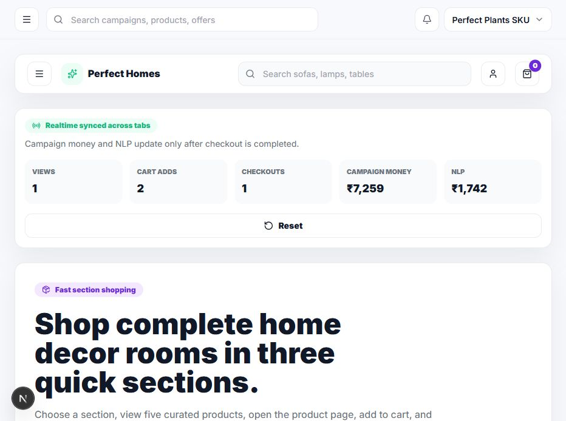
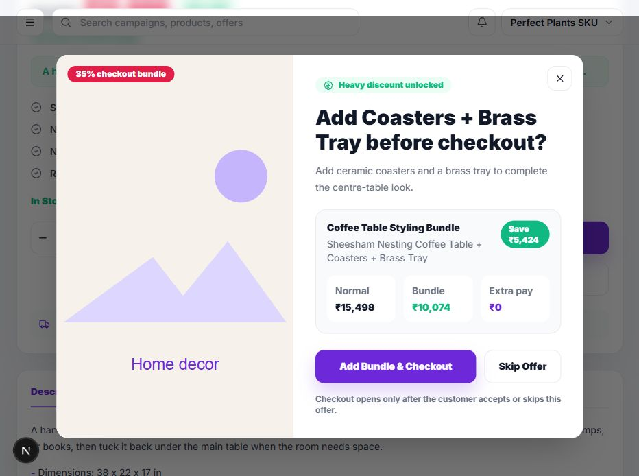
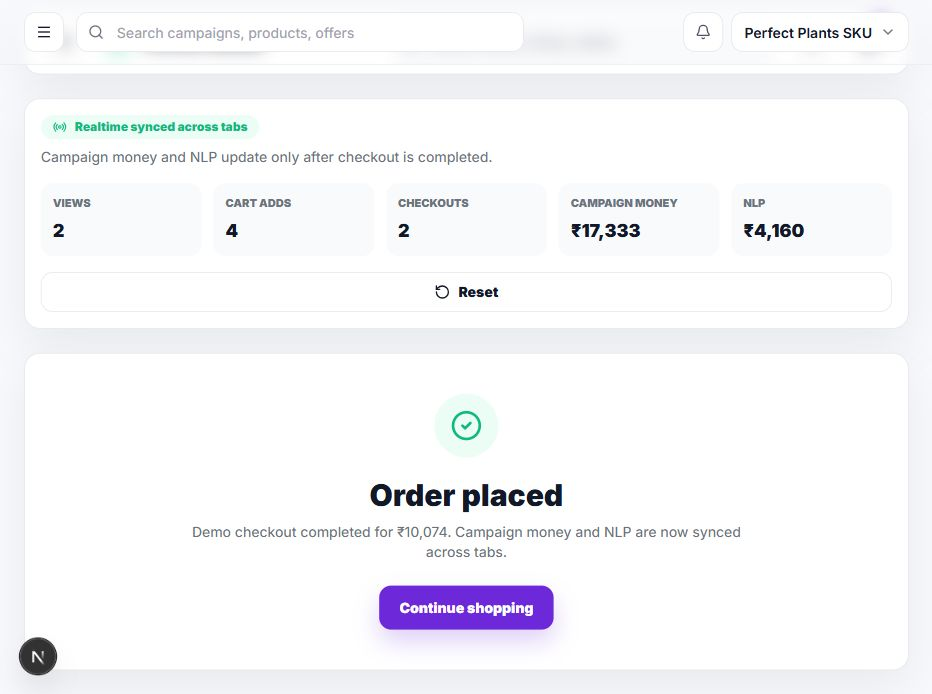

# Perfect Plants SKU

Perfect Plants SKU is a production-style Shopify embedded SaaS demo for D2C brands that want better post-purchase and bundle revenue. It includes a Shopify admin dashboard, a customer shopping storefront, a cart bundle offer flow, realtime analytics, a NestJS API, Prisma schema, and a Shopify Checkout UI Extension for Thank You page offers.

Live website: [https://perfect-plants-sku.vercel.app/shopping](https://perfect-plants-sku.vercel.app/shopping)

## Screenshots

### Shopping Sections



### Checkout Bundle Offer



### Realtime Checkout Success



## What It Does

- Shows a premium home decor storefront inspired by Flipkart/Amazon product browsing.
- Organizes products into three fast-shopping sections.
- Includes 15 curated SKUs, five products per section.
- Gives every product a full product page with four images, description, specs, pricing, trust badges, and recommendations.
- Adds products to a cart drawer or cart page.
- Gates checkout behind a bundle offer popup with a heavy discount.
- Updates dashboard, analytics, campaign rows, funnel metrics, revenue charts, and best-performing offers only after checkout is completed.
- Attributes live analytics to the exact purchased SKU and bundle outcome.
- Syncs storefront analytics across open browser tabs with `localStorage` and `BroadcastChannel`.
- Includes a Shopify Thank You page Checkout UI Extension targeting `purchase.thank-you.block.render`.
- Provides backend APIs for campaign matching, discounts, analytics, and Shopify webhooks.

## Customer Flow

1. Customer opens the shopping page.
2. Customer chooses a section such as Living Room Comfort, Tables & Storage, or Decor & Lighting.
3. Customer sees five relevant products in that section.
4. Customer opens a product page.
5. Customer adds the product to cart.
6. Customer clicks checkout.
7. A bundle offer popup appears before checkout.
8. Customer accepts or skips the offer.
9. Checkout opens.
10. Customer places the order.
11. Campaign money, bundle revenue, and NLP metrics update in realtime.

## Shopify Flow

1. Customer completes checkout in Shopify.
2. Checkout UI Extension renders on the Thank You page.
3. Extension reads order and purchased product data.
4. Extension calls the backend offer matching API.
5. Backend campaign engine returns the best post-purchase offer.
6. Extension renders the offer block and tracks impressions/clicks.
7. Customer clicks the offer CTA and is redirected with a discount.

This app intentionally avoids deprecated Shopify customization surfaces:

- No `checkout.liquid`
- No Additional Scripts
- No ScriptTags

It uses modern Shopify Checkout UI Extensions, Admin APIs, GraphQL discount APIs, and webhooks.

## Tech Stack

- Frontend: Next.js App Router, React, TypeScript, TailwindCSS, Shopify Polaris, Shopify App Bridge
- Storefront UX: React client components, local cart state, realtime BroadcastChannel analytics
- Backend: Node.js, NestJS, Prisma ORM
- Database: PostgreSQL-ready Prisma schema
- Shopify: Checkout UI Extensions, Admin APIs, app webhooks
- Deployment: Vercel for frontend, Railway-ready backend config
- CI: GitHub Actions typecheck and frontend build workflow

## Repository Structure

```txt
.
├── .github/workflows/ci.yml
├── api/
├── backend/
│   └── src/
│       ├── analytics/
│       ├── auth/
│       ├── campaigns/
│       ├── common/
│       ├── offers/
│       ├── prisma/
│       └── webhooks/
├── docs/
│   ├── ARCHITECTURE.md
│   └── screenshots/
├── extensions/
│   └── post-purchase-offer/
│       └── src/
├── frontend/
│   └── src/
│       ├── app/
│       ├── components/
│       ├── hooks/
│       ├── lib/
│       └── utils/
├── prisma/
├── shopify.app.toml
├── vercel.json
└── railway.json
```

## Key Files

- `frontend/src/components/ShoppingRealtimeClient.tsx`: customer shopping flow, cart, bundle modal, checkout, success state.
- `frontend/src/lib/storefront-products.ts`: three storefront sections and 15 demo products with images and bundle metadata.
- `frontend/src/hooks/useStorefrontRealtime.ts`: realtime local analytics synced across tabs.
- `frontend/src/components/CampaignsClient.tsx`: campaign analytics page connected to storefront demo stats.
- `backend/src/offers/offer-engine.service.ts`: offer matching and rule engine.
- `prisma/schema.prisma`: Store, Campaign, Rule, Offer, Discount, OfferView, OfferClick, and OfferPurchase models.
- `extensions/post-purchase-offer/src/Checkout.tsx`: Shopify Thank You page offer block.

## Local Setup

```bash
npm install
cp .env.example .env
npm run prisma:generate
npm run prisma:migrate
npm run db:seed
npm run dev
```

PowerShell users can run `npm.cmd` instead of `npm` if script execution is disabled.

Frontend only:

```bash
npm run dev --workspace frontend
```

Open:

```txt
http://localhost:3000/shopping
```

## Validation

```bash
npm run typecheck
npm run lint
npm run build
```

The current published build was validated with all three commands.

## Environment Variables

Copy `.env.example` to `.env` and provide real values for Shopify, database, and deployment environments.

Common variables:

```txt
DATABASE_URL=
SHOPIFY_API_KEY=
SHOPIFY_API_SECRET=
SHOPIFY_SCOPES=
APP_URL=
BACKEND_URL=
NEXT_PUBLIC_SHOPIFY_API_KEY=
NEXT_PUBLIC_API_URL=
```

## Shopify Setup

1. Create a Shopify app in the Partner Dashboard or with Shopify CLI.
2. Fill the required variables in `.env`.
3. Update `shopify.app.toml` with your app URL, client ID, scopes, and dev store.
4. Run:

```bash
shopify app dev
```

The checkout extension target is configured here:

```txt
extensions/post-purchase-offer/shopify.extension.toml
```

The extension is pinned to API version `2025-10` because that version supports the required `purchase.thank-you.block.render` target.

## Backend API

Important routes:

- `GET /health`
- `GET /auth/install`
- `GET /auth/callback`
- `GET /campaigns`
- `POST /campaigns`
- `PUT /campaigns/:id`
- `POST /campaigns/:id/duplicate`
- `DELETE /campaigns/:id`
- `POST /offers/match`
- `POST /analytics/impression`
- `POST /analytics/click`
- `POST /analytics/purchase`
- `POST /webhooks/app/uninstalled`
- `POST /webhooks/orders/create`
- `POST /webhooks/orders/paid`

Example offer match payload:

```json
{
  "shop": "perfectplants.myshopify.com",
  "orderId": "12345",
  "products": ["gid://shopify/Product/111"],
  "collections": ["10"],
  "orderValue": 2499,
  "customerType": "first_time",
  "paymentType": "cod"
}
```

## Deployment

Frontend is deployed on Vercel:

[https://perfect-plants-sku.vercel.app/shopping](https://perfect-plants-sku.vercel.app/shopping)

Deploy frontend manually:

```bash
npx vercel deploy --prod
```

Backend is Railway-ready:

```bash
railway up
```

For production Shopify use, deploy the backend to a public HTTPS URL, set `NEXT_PUBLIC_API_URL` to that backend URL, and update Shopify app URLs/webhook URLs.

## CI

GitHub Actions runs:

- `npm ci`
- `npm run typecheck`
- `npm run prisma:generate && npm run build --workspace frontend`

See `.github/workflows/ci.yml`.

## Architecture

See [docs/ARCHITECTURE.md](docs/ARCHITECTURE.md) for the system map and detailed flow.

## License

MIT
