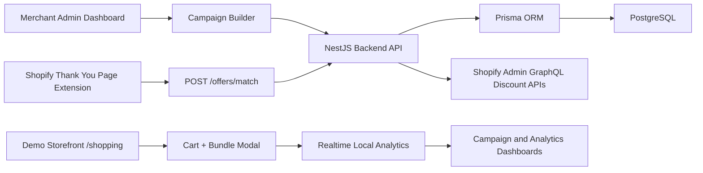

# Perfect Plants SKU Architecture

Perfect Plants SKU is a demo-ready Shopify growth application with a storefront simulation, merchant dashboard, campaign engine API, Prisma data model, and Shopify Checkout UI Extension.

## System Map



## Major Modules

- `frontend/`: Next.js App Router, React, TypeScript, TailwindCSS, Shopify Polaris, and App Bridge.
- `backend/`: NestJS API for OAuth, stores, campaigns, rule matching, analytics, discounts, and webhooks.
- `extensions/post-purchase-offer/`: Shopify Checkout UI Extension targeting `purchase.thank-you.block.render`.
- `prisma/`: PostgreSQL schema for stores, campaigns, rules, offers, discounts, views, clicks, and purchases.
- `api/`: Lightweight serverless compatibility helpers for deployment providers.

## Storefront Flow

1. Customer opens `/shopping`.
2. Customer picks one of three sections.
3. Section displays five curated home decor SKUs.
4. Customer opens a full product page with four gallery images.
5. Customer adds the SKU to cart.
6. Checkout is gated by a bundle offer modal.
7. Customer accepts or skips the bundle.
8. Checkout completes and realtime campaign/NLP metrics update across browser tabs.

## Shopify Flow

1. Customer completes checkout in Shopify.
2. Checkout UI Extension renders on the Thank You page.
3. Extension reads order and purchased product data.
4. Extension calls `POST /offers/match`.
5. Backend rule engine returns the best campaign offer.
6. Extension tracks impression/click analytics and redirects with a generated discount.

## Deployment Split

- Frontend demo and dashboard: Vercel.
- Backend API: Railway or any Node host with PostgreSQL.
- Database: PostgreSQL managed by Railway, Neon, Supabase, or similar.
- Shopify extension: Shopify CLI deployment.

## Validation

Use these commands before publishing changes:

```bash
npm run typecheck
npm run lint
npm run build
```
